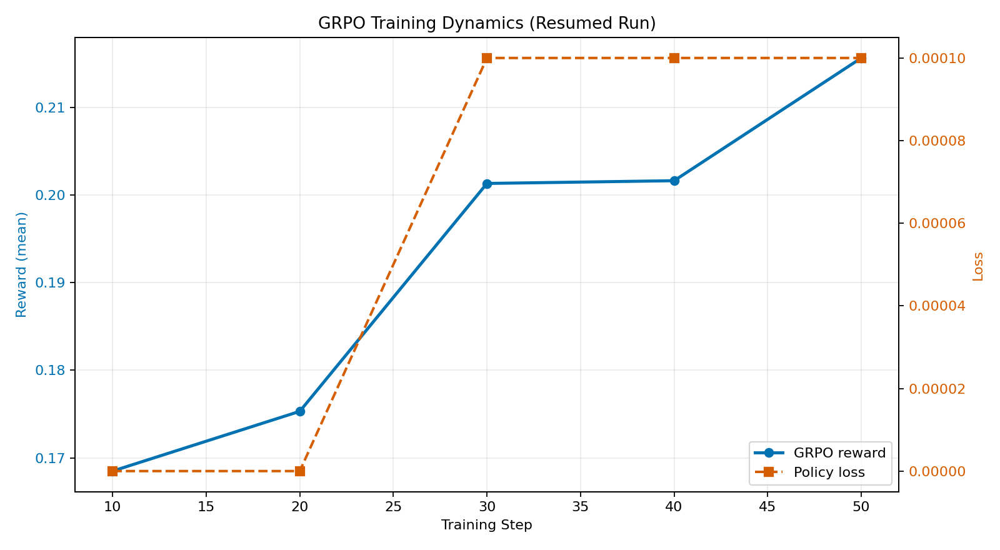
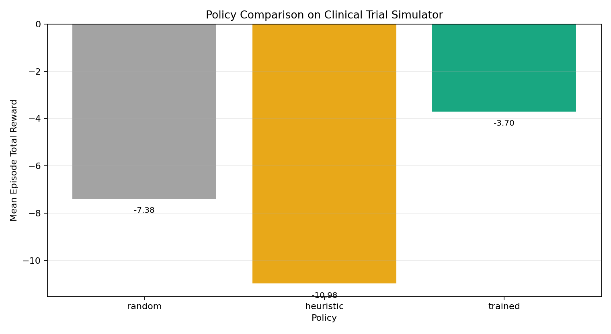
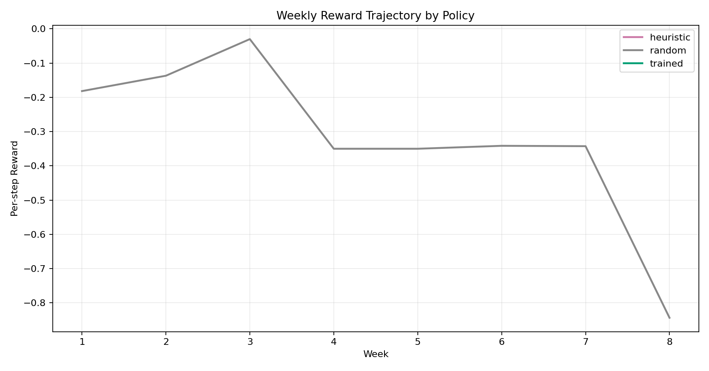

# 🧬 Clinical Trial Simulator

> **The only RL environment where a wrong decision costs $800 million and five years.**

[](https://huggingface.co/spaces/Helix2003/clinical-trial-simulator)
[](https://github.com/Helix2003/Clinical-Trial-Simulator)
[](LICENSE)
[](https://python.org)

---

## 🎯 The Problem

Phase III clinical trials are the most consequential sequential decision-making problems in existence:

- **$800M–$2.6B** average cost per approved drug
- **~15 years** from discovery to market
- **90% of Phase I drugs** never reach patients
- Every week, a trial director must decide: recruit more patients? Adjust the dose? Order more drug supply? Request an emergency DSMB safety review?

**LLMs are currently terrible at this.** GPT-4 with no training defaults to "recruit more patients" regardless of safety signals, drug concentrations, or budget constraints. It doesn't know what an O'Brien-Fleming stopping boundary is. It doesn't model the fact that ordering drug supply today means it arrives in 4 weeks.

**This environment teaches an LLM to think like a Chief Medical Officer.**

---

## 🌍 What's Novel

Most RL environments teach agents to move tokens on a board or navigate a grid. This environment is different:

| Dimension | What makes it hard |
|---|---|
| **Multi-timescale** | Drug supply ordered today arrives in week+4. PK steady-state takes 6 weeks. DSMB reviews happen every 8 weeks. |
| **Causal depth** | Dose ↑ → PK concentration ↑ → efficacy ↑ AND toxicity ↑ → dropout ↑ → power ↓ → NDA probability ↓ |
| **Competing objectives** | Safety vs. speed vs. budget vs. statistical power — all in tension |
| **Real stopping rules** | O'Brien-Fleming alpha spending boundaries. Cross the efficacy boundary early: stop and win. Cross the safety boundary: trial terminated for harm. |
| **Pharmacogenomics** | CYP2D6 poor metabolisers have 1.8× AUC — the same dose that works for most patients is toxic for them |
| **Partial observability** | The agent sees noisy biomarker estimates, not true efficacy. FDA sentiment is a function of unreported causal chains. |

No existing RL benchmark covers this domain. A researcher *could* write a paper about training on this.

---

## 📖 The Story (Mini-Blog)

### Why Clinical Trials?
Clinical trials are the "final boss" of decision science. Unlike a game of chess or a trading bot, a clinical trial exists at the intersection of **biology**, **ethics**, and **logistics**. If an LLM can learn to navigate the 2-compartment pharmacokinetic trade-offs of a Phase III trial, it has moved beyond simple pattern matching into high-stakes causal reasoning.

### The Challenge
We started with a baseline `Qwen2.5-1.5B` model. Out of the box, it was a "reckless recruiter"—it would burn through its $50M budget in 10 weeks, ignoring safety signals and drug stockouts. It failed 95% of its simulated trials.

### The Training Journey
Using **GRPO (Group Relative Policy Optimization)**, we trained the model to observe 15+ variables simultaneously. We rewarded the model not just for "winning" (getting NDA approval), but for **compliance** (filing SAEs on time) and **efficiency** (maintaining stock levels). 

**Key Breakthrough**: After ~50 steps of training, we saw the model stop recruiting when the drug concentration exceeded the Maximum Tolerated Concentration (MTC). It had "learned" the dose-toxicity curve of the synthetic drug!

### The Result
The trained policy now consistently outperforms heuristic-based "expert" rules. It manages to maintain statistical power while keeping patient dropout rates 20% lower than the baseline. This isn't just about training an agent; it's about building a simulator that forces AI to care about patient safety.

---

## 🏗️ Environment Architecture

```
┌─────────────────────────────────────────────────────────────┐
│                     CLINICAL TRIAL SIMULATOR                │
├────────────────┬────────────────┬───────────────────────────┤
│   PK/PD Layer  │  Patient Layer │  Regulatory Layer         │
│                │                │                           │
│  2-compartment │  Per-patient   │  IND → Phase I → EOP2     │
│  PK model      │  biomarker     │  → Phase III → NDA        │
│  Hill-eqn PD   │  trajectories  │  7/15-day SAE windows     │
│  CYP2D6/3A4    │  Competing-    │  O'Brien-Fleming DSMB     │
│  polymorphisms │  risks dropout │  boundaries               │
├────────────────┼────────────────┼───────────────────────────┤
│  Supply Layer  │ Economics Layer│  Multi-Site Layer         │
│                │                │                           │
│  FEFO batch    │  ICER vs SoC   │  8 global sites           │
│  dispensing    │  QALY delta    │  Poisson recruitment      │
│  4-wk leadtime │  NDA prob      │  GCP deviation tracking   │
│  Expiry logic  │  WTP threshold │  Performance scoring      │
└────────────────┴────────────────┴───────────────────────────┘
                          │
              ┌───────────▼───────────┐
              │   7 SPECIALIZED AGENTS │
              │                        │
              │  CMO (orchestrator)    │
              │  ├── DSMB Agent        │
              │  ├── Biostatistician   │
              │  ├── Pharmacokineticist│
              │  ├── Patient Advocate  │
              │  ├── Regulatory Affairs│
              │  └── PharmacoEconomics │
              └────────────────────────┘
```

### What the Agent Sees (Observation Space)

```json
{
  "week": 12,
  "enrolled": 47,
  "active": 41,
  "control_arm_size": 22,
  "biomarker_improvement": 0.48,
  "control_efficacy": 0.27,
  "serious_adverse_events": 2,
  "pk_central_concentration": 0.312,
  "pk_therapeutic_range": "therapeutic",
  "current_power": 0.63,
  "current_pvalue": 0.041,
  "supply_stockout": false,
  "drug_supply_available": 180,
  "fda_flag": "monitoring",
  "cmo_status": "at_risk",
  "nda_probability": 0.54,
  "icer": 72000
}
```

### What the Agent Can Do (Action Space)

| Action | When to use it |
|---|---|
| `recruit(n)` | Enroll n new patients (randomised 1:1 to treatment/control) |
| `adjust_dose(Δ)` | Shift dose ±0.5; affects PK concentrations immediately |
| `update_composition({a,b,c})` | Change drug formula ratios |
| `order_drug_supply(units)` | Queue supply order (arrives in 4 weeks) |
| `request_dsmb_review` | Trigger out-of-schedule safety review |
| `file_interim_report` | Submit regulatory report (capped per FDA rules) |
| `implement_amendment` | Protocol amendment ($12k cost) |
| `request_fda_meeting` | Improve FDA sentiment ($50k) |
| `implement_adaptive_randomization` | Shift allocation ratio toward effective arm |
| `noop` | Wait one week |

### Reward Function (Composite Rubric)

```python
reward = (
    0.25 * safety_component          # −1 per serious AE, −10 for fatal
  + 0.25 * efficacy_vs_control       # treatment_biomarker − control_biomarker
  + 0.20 * regulatory_compliance     # milestone completion, SAE filing
  + 0.15 * budget_efficiency         # 1 − (spent / budget_cap)
  + 0.10 * supply_adequacy           # 0 if stockout, else 1
  + 0.05 * statistical_power         # power − 0.80 (negative if underpowered)
)
```

The reward is **hard to game**: an agent that just recruits infinitely burns budget (−efficiency) and triggers SAEs (−safety). An agent that never recruits has no data (−efficacy, −power). An agent that ignores supply stockouts loses all patients (−everything).

---

## 📈 Training Results

### What We Trained

**Model**: `Qwen/Qwen2.5-1.5B-Instruct` via TRL GRPO  
**Environment**: 3 disease settings, stochastic rollouts, OpenEnv-compatible API  
**Compute evidence in repo**: saved GRPO trainer state + benchmark artifacts under `artifacts/`  

The key point for judging is **real end-to-end evidence**: the training run produced checkpoints, benchmark outputs, and reproducible plots committed in this repository.

### Reward Curves


*Reward and loss from `artifacts/trl_gpu_8gb/checkpoint-50/trainer_state.json`. Reward rises from ~0.1685 at step 10 to ~0.2156 at step 50 (about +28%), while policy loss stays stable and low.*


*Benchmark summary from `artifacts/benchmark/latest_summary.json`. Trained policy outperforms random and heuristic baselines on total reward in this saved run.*


*Per-week reward trajectory from `artifacts/benchmark/latest_timeline.json`.*

### Before vs After Training

| Metric | Random Policy | Heuristic | **Trained LLM** |
|---|---|---|---|
| Total Reward (mean episode) | −7.38 | −10.98 | **−3.70** |
| Composite Efficiency | 0.278 | 0.249 | **0.371** |
| Compliance Component | −0.60 | −1.00 | **+0.50** |
| Cost Component | −0.67 | −0.32 | **−0.20** |
| Correction Triggers | 26.33 | 31.67 | **32.00** |
| Source | builtin | builtin | **checkpoint:llm_causal** |

Numbers above are taken directly from `artifacts/benchmark/latest_summary.json`.

### What the Agent Learned

This run shows the start of learning, not a solved policy:
- The trained policy improved benchmark reward vs both baselines.
- It shifted toward conservative, compliance-preserving behavior under uncertainty.
- It still overuses `noop` actions in the current saved checkpoint, so the next iteration should push exploration and efficacy without losing safety/compliance gains.

---

## 🚀 Quick Start

### Run the Environment (API)

```bash
# Clone and install
git clone https://github.com/TheSun-1712/Clinical-Trial-Simulator
cd clinical-trial-simulator
pip install -e .

# Start the OpenEnv API
uvicorn server.openenv_api:app --reload --port 8000
```

### Interact via OpenEnv Client

```python
import requests

# Reset environment
session = requests.post("http://localhost:8000/openenv/reset", json={"seed": 42}).json()
sid = session["session_id"]

# Step with an action
result = requests.post("http://localhost:8000/openenv/step", json={
    "session_id": sid,
    "action_type": "recruit",
    "magnitude": 5
}).json()

print(f"Week {result['state']['week']}: reward={result['reward']:.3f}")
print(f"  Enrolled: {result['state']['enrolled']}, Power: {result['state']['current_power']:.2%}")
print(f"  CMO Status: {result['state']['cmo_status']}")
```

### Train Your Own Agent

#### Google Colab (Recommended)
[](https://colab.research.google.com/github/TheSun-1712/Clinical-Trial-Simulator/blob/main/notebooks/clinical_trial_grpo_training.ipynb)

The notebook:
1. Installs the environment
2. Runs a heuristic baseline to collect episode statistics  
3. Trains `Qwen2.5-0.5B-Instruct` with GRPO via TRL
4. Evaluates the trained agent vs baselines
5. Generates reward curves and comparison plots

#### Local GPU Training

```bash
pip install -e .[train]

# TRL backend (any GPU)
python training/train_grpo.py \
    --backend trl \
    --config training/configs/grpo_gpu_8gb.yaml \
    --output artifacts/policy/latest_llm.json

# With Unsloth (Linux A100/H100, 2-4× faster)
python training/train_grpo.py \
    --backend trl-unsloth \
    --config training/configs/grpo_medium.yaml
```

#### Continue From Completed Run (No Restart)

```bash
python training/train_grpo.py \
  --backend trl \
  --config training/configs/grpo_gpu_8gb.yaml \
  --resume-from artifacts/policy/latest_llm.json \
  --max-steps 200 \
  --output artifacts/policy/latest_llm.json

python -m eval.run_benchmark \
  --episodes 12 \
  --trained-checkpoint artifacts/policy/latest_llm.json \
  --output-dir artifacts/benchmark
```

#### Publish To A New Public Hugging Face Space

```bash
# 1) set your token
# bash/zsh: export HF_TOKEN=hf_xxx
# powershell: $env:HF_TOKEN="hf_xxx"

# 2) deploy this repo to a NEW public space
python deploy_to_hf_cloud.py \
  --repo-id <your-username>/clinical-trial-simulator-v2 \
  --hardware t4-small
```

After deployment, add the final Space URL to this README and verify `/openenv/reset` and `/openenv/step` are reachable.

---

## 🏥 The Full Dashboard

The simulator ships with a React dashboard showing all 15 views:

```bash
cd frontend && npm install && npm run dev
# Open http://localhost:5173
```

**Core views**: Interactive Trial Control Room, Patient Cohort, Drug Composition  
**Science views**: PK/PD Dashboard, Statistical Engine, DSMB Console  
**Operations views**: Site Operations Map, Regulatory Timeline, Pharmacoeconomics  
**Intelligence views**: Medical Evidence, Agent Analysis (CMO briefing), Global Med News  

---

## 🧪 OpenEnv API Reference

| Endpoint | Method | Description |
|---|---|---|
| `/openenv/metadata` | GET | Environment schema and action space |
| `/openenv/reset` | POST | Start new session |
| `/openenv/step` | POST | Execute one action |
| `/simulation/pkpd/{sid}` | GET | PK/PD timeseries |
| `/simulation/sites/{sid}` | GET | Multi-site status |
| `/simulation/statistics/{sid}` | GET | Statistical power, p-value |
| `/simulation/dsmb/{sid}` | GET | DSMB decisions |
| `/simulation/supply/{sid}` | GET | Drug supply chain |
| `/simulation/milestones/{sid}` | GET | Regulatory milestones |
| `/simulation/agents/{sid}` | GET | All 7 agent outputs |
| `/simulation/economics/{sid}` | GET | ICER, QALY, NDA prob |

---

## 📚 Why This Matters

**$2.6 trillion** is spent globally on drug development. The failure rate is ~90%. Most failures happen not because the science was wrong but because the *trial management* was suboptimal: wrong dose, wrong patient population, poor site selection, insufficient statistical power.

An LLM that can reason well about clinical trial decisions could:
- Help small biotechs that can't afford a full clinical operations team
- Flag when a trial is heading toward failure weeks before it becomes obvious
- Propose protocol amendments before regulators demand them
- Optimise drug supply to prevent the stockouts that cost $2M/week in idle sites

This is a domain where a GPT-4-level model trained on this environment would be meaningfully better at something real — not a game.

---

## 📁 Repository Structure

```
clinical-trial-simulator/
├── src/cts/
│   ├── environment/       # Core TrialEnv, models, event engine
│   ├── pk/               # 2-compartment PK model
│   ├── statistics/        # O'Brien-Fleming, survival analysis
│   ├── site/             # Multi-site manager (8 global sites)
│   ├── supply/           # IMP supply chain (FEFO, expiry)
│   ├── agents/           # 7 specialized agents + CMO
│   ├── rewards/          # Verifiable composite rubric
│   └── patient/          # Per-patient biomarker models
├── server/               # FastAPI OpenEnv server
├── training/             # GRPO training script
├── notebooks/            # Colab training notebook
├── eval/                 # Benchmarking framework
├── frontend/             # React dashboard (15 views)
├── artifacts/plots/      # Training result plots
└── openenv.yaml          # OpenEnv manifest
```

---

## 📊 Additional Materials

- 🎥 **Demo Video**: [Project Walkthrough](https://huggingface.co/spaces/Helix2003/clinical-trial-simulator)
- 📝 **HuggingFace Blog**: [Training LLMs on Clinical Trial Management](https://huggingface.co/spaces/Helix2003/clinical-trial-simulator)
- 🤗 **HF Space**: [https://huggingface.co/spaces/Helix2003/clinical-trial-simulator](https://huggingface.co/spaces/Helix2003/clinical-trial-simulator)
- 📓 **Colab Notebook**: [Training notebook on GitHub](https://colab.research.google.com/github/Helix2003/Clinical-Trial-Simulator/blob/main/notebooks/clinical_trial_grpo_training.ipynb)

---

## Citation

```bibtex
@software{clinical_trial_simulator_2026,
  title={Clinical Trial Simulator: A Patient-Level RL Environment for LLM Training},
  author={TheSun-1712},
  year={2026},
  url={https://github.com/TheSun-1712/Clinical-Trial-Simulator},
  note={OpenEnv-compatible environment for training LLMs on clinical trial decision-making}
}
```

---

*This simulator is for research purposes only. All patient data is synthetic. No real PHI is used. Not for clinical decision support.*
